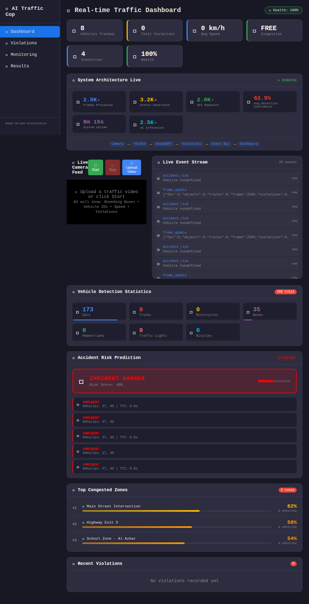
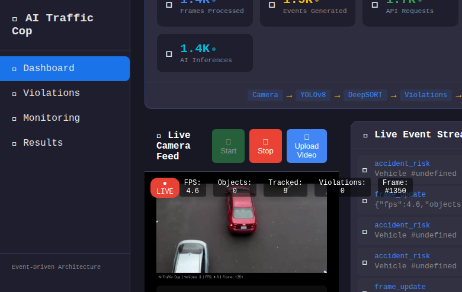
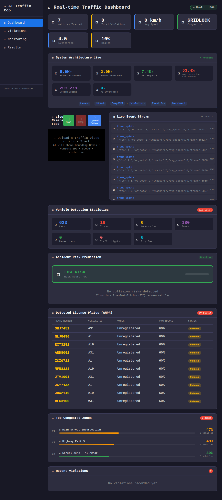
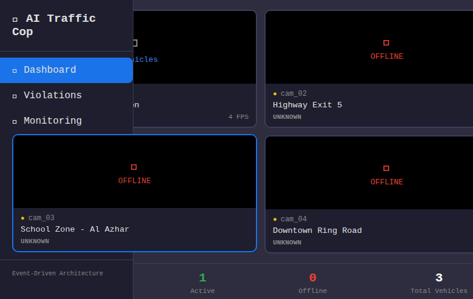
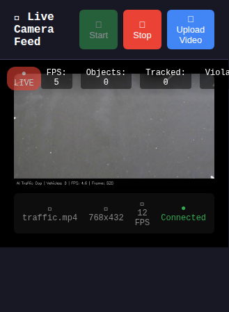
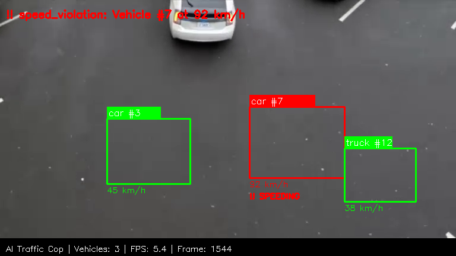

# 🚔 AI Traffic Cop System

[](https://github.com/mohamedshhahat1/AI-TRAFFIC-COP-SYSTEM/actions)


An **intelligent traffic surveillance and enforcement platform** combining deep learning computer vision, real-time tracking, and smart city analytics. Detects traffic violations, predicts accidents, recognizes license plates, and optimizes traffic signal timing using reinforcement learning.

---

## 🌟 Features

### 🎯 Core AI Engine
| Feature | Technology | Description |
|---------|-----------|-------------|
| **Object Detection** | YOLOv8 (Ultralytics) | Real-time vehicle, pedestrian, and traffic light detection |
| **Multi-Object Tracking** | DeepSORT | Persistent vehicle tracking with unique IDs across frames |
| **Speed Estimation** | Pixel-to-World Calibration | Per-camera configurable speed measurement with perspective transform |
| **Violation Detection** | Rule-based + CV | Speed violations, red light running, illegal lane changes, parking violations |
| **Accident Prediction** | Physics-based TTC | Time-to-collision analysis with trajectory prediction and risk scoring |
| **License Plate Recognition (ANPR)** | OCR Pipeline | Automatic plate detection, character recognition, and owner database lookup |
| **RL Signal Optimization** | PPO/DQN (Stable-Baselines3) | Reinforcement learning for adaptive traffic signal control |
| **Multi-Camera Fusion** | Re-ID + Spatial | Cross-camera vehicle tracking and city-wide analytics |

### 🖥️ Backend (FastAPI)
- **RESTful API** with full CRUD for violations, vehicles, plates, analytics
- **WebSocket** real-time event streaming (violations, tracking, accidents, RL decisions)
- **Event Bus** architecture (pub/sub) for decoupled components
- **SQLite/PostgreSQL** database with async SQLAlchemy ORM
- **API Key authentication** with rate limiting (600 req/min default)
- **Prometheus-compatible** metrics export
- **Health monitoring** with component status tracking
- **File upload** with validation, sanitization, and size limits

### 📊 Frontend (React) — 6 Pages
- **Real-time Dashboard** — live camera feed (MJPEG), stats cards, system architecture counters, detection stats, accident risk panel, detected plates (ANPR), traffic heatmap, multi-camera overview, violation table
- **Violations** — full violation history with type/severity filtering, plate violation table, event bus history
- **RL Signal Control** — live traffic light visualization, agent configuration (DQN/PPO), start/stop controls, 4-phase selector, intersection view with directional signals, RL performance metrics, phase time distribution, metrics history, CV-to-RL bridge stats, trained model management
- **Multi-Camera** — grid/list view toggle, network overview (cameras, vehicles, FPS, uptime), expandable camera tiles with live feeds, per-camera detail panel, congestion overview bars
- **Monitoring** — system health with component status, performance metrics (FPS, latency, p95), event bus stats (emitted, handled, dead letters, success rate), filterable system logs
- **Results & Evaluation** — live metrics table (confidence, FPS, frames, vehicles, violations, processing time, events, inferences, uptime, API requests), detection breakdown by class, technology stack reference, academic notes

### 📱 Mobile App (Flutter)
- Real-time violation alerts via WebSocket
- Camera monitoring and control
- Event history browsing
- System health dashboard

### 🤖 RL Traffic Signal Control
- **Custom Gymnasium environment** simulating intersection traffic
- **PPO and DQN agents** trained with Stable-Baselines3
- **Live integration** — CV pipeline feeds vehicle data to RL via CV-to-RL bridge
- **Reward functions** balancing throughput, wait time, and fairness
- **Signal controller** with safety constraints (min/max green, yellow transitions, all-red clearance)
- **Frontend dashboard** — traffic light visualization, phase control, intersection view, metrics
- **REST API** — 11 endpoints for full RL control (`/api/rl/*`)
- **TensorBoard** training visualization
- **Model management** — list, load, and switch between trained models

---

## 🏗️ Architecture

```
┌──────────────────────────────────────────────────────────────────────────────────┐
│                                Frontend (React)                                  │
│  Dashboard │ Violations │ RL Signal Control │ Multi-Camera │ Monitoring │ Results │
└──────────────────────────────────────┬───────────────────────────────────────────┘
                                       │ HTTP / WebSocket
┌──────────────────────────────────────┴───────────────────────────────────────────┐
│                              Backend (FastAPI)                                    │
│      Auth │ Rate Limit │ Routes │ WebSocket │ Event Bus │ DB │ RL Routes          │
└──────────────────────────────────────┬───────────────────────────────────────────┘
                                       │
┌──────────────────────────────────────┴───────────────────────────────────────────┐
│                                   AI Engine                                       │
│  ┌──────────┐  ┌──────────┐  ┌────────────┐  ┌──────────────┐                   │
│  │ YOLOv8   │→│ DeepSORT │→│  Speed      │→│  Violations   │                   │
│  │ Detector │  │ Tracker  │  │  Estimator │  │  Engine       │                   │
│  └──────────┘  └──────────┘  └────────────┘  └──────────────┘                   │
│  ┌──────────┐  ┌──────────┐  ┌────────────┐  ┌──────────────┐                   │
│  │ Accident │  │   ANPR   │  │ Multi-Cam  │  │  RL Signal   │                   │
│  │ Predictor│  │ Pipeline │  │  Fusion    │  │  Controller  │                   │
│  └──────────┘  └──────────┘  └────────────┘  └──────────────┘                   │
└──────────────────────────────────────────────────────────────────────────────────┘
```

---

## 📸 Screenshots

| Dashboard | Live Detection |
|:---------:|:--------------:|
|  |  |

| ANPR (License Plates) | Multi-Camera Grid |
|:---------------------:|:-----------------:|
|  |  |

| Live Camera Feed | Annotated Frame |
|:----------------:|:---------------:|
|  |  |

---

## 🚀 Quick Start

### Prerequisites
- Python 3.11+
- Node.js 18+
- pip

### 1. Clone & Install

```bash
git clone https://github.com/mohamedshhahat1/AI-TRAFFIC-COP-SYSTEM.git
cd AI-TRAFFIC-COP-SYSTEM
make install          # pip install -r requirements.txt
```

### 2. Download AI Models

```bash
make models           # Downloads YOLOv8 Nano (~6MB)
# Or for better accuracy:
python scripts/download_models.py --model yolov8s
```

### 3. Configure Environment

```bash
cp .env.example .env
# Edit .env with your settings (API_KEY, SMTP, etc.)
```

### 4. Run Backend

```bash
make run              # uvicorn backend.app.main:app --reload
# API: http://localhost:8000
# Docs: http://localhost:8000/api/docs (when DEBUG=true)
```

### 5. Run Frontend

```bash
make run-frontend     # cd frontend && npm install && npm start
# Dashboard: http://localhost:3000
```

### 6. Docker (Alternative)

```bash
make docker-run       # docker-compose up --build
```

---

## 📁 Project Structure

```
AI-TRAFFIC-COP-SYSTEM/
├── ai_engine/                  # Core AI modules
│   ├── detection/              # YOLOv8 object detection
│   ├── tracking/               # DeepSORT multi-object tracking
│   ├── speed_estimation/       # Speed calculation + calibration
│   ├── violation_detection/    # Speed, red light, lane, parking
│   ├── prediction/             # Accident prediction (TTC)
│   ├── plate_recognition/      # ANPR pipeline (detect → OCR → match)
│   ├── smart_city/             # Multi-camera fusion + analytics
│   ├── event_bus/              # Pub/sub event system
│   ├── api_bridge/             # InferenceService + AIGateway
│   ├── monitoring/             # Logging + metrics
│   └── pipeline.py             # Main processing pipeline
├── backend/                    # FastAPI server
│   ├── app/
│   │   ├── main.py             # App entry point
│   │   ├── config.py           # Environment-based settings
│   │   ├── middleware/         # Auth + rate limiting
│   │   ├── routes/             # API endpoints (violations, vehicles, plates, analytics)
│   │   ├── models/             # SQLAlchemy ORM models
│   │   ├── services/           # DB + alert services
│   │   └── video_processor.py  # Frame processing + annotation
│   └── requirements.txt
├── frontend/                   # React dashboard
│   └── src/
│       ├── components/         # UI components (camera, heatmap, plates, etc.)
│       ├── pages/              # Dashboard, Violations, RLSignalControl, MultiCamera, Monitoring, Results
│       └── services/           # API service layer
├── mobile_app/                 # Flutter mobile app
│   └── lib/
│       ├── screens/            # App screens
│       ├── services/           # API + event services
│       └── widgets/            # Reusable widgets
├── rl_signal_control/          # Reinforcement Learning module
│   ├── environment/            # Gymnasium traffic environment
│   ├── agents/                 # PPO, DQN agents
│   ├── training/               # Train + evaluate scripts
│   └── integration/            # Live RL ↔ CV bridge
├── configs/                    # YAML configuration
├── docker/                     # Docker deployment
├── scripts/                    # Utility scripts (download, train, export)
├── tests/                      # Comprehensive test suite
├── data/                       # Data directory (videos, annotations)
├── models/                     # AI model weights
├── .github/workflows/          # CI/CD pipeline
├── .env.example                # Environment variables template
├── Makefile                    # Standardized commands
├── pyproject.toml              # pytest + coverage config
├── requirements.txt            # Python dependencies (pinned)
└── CONTRIBUTING.md             # Development guidelines
```

---

## 🔧 Configuration

### Environment Variables

| Variable | Description | Default |
|----------|-------------|---------|
| `DEBUG` | Enable debug mode + API docs | `false` |
| `PORT` | Backend server port | `8000` |
| `DATABASE_URL` | DB connection string | SQLite |
| `API_KEY` | Authentication key (empty = dev mode) | `` |
| `CORS_ORIGINS` | Allowed origins (comma-separated) | localhost |
| `RATE_LIMIT_PER_MINUTE` | Max requests/IP/minute | `600` |
| `SMTP_HOST` | Alert email server | `smtp.gmail.com` |
| `ALERT_EMAIL` | Violation alert recipient | `` |
| `REACT_APP_API_URL` | Frontend API URL | `/api` |

### Per-Camera Calibration

```yaml
# configs/camera_config.yaml
cameras:
  - id: "cam_01"
    location: "Main Street"
    pixel_to_meter: 0.048    # Calibrated per camera
    speed_limit: 50.0         # Zone speed limit (km/h)
    fps: 25                   # Camera FPS
```

---

## 🧪 Testing

```bash
make test             # Run all tests
make test-cov         # With coverage report
make lint             # Code style (ruff)
```

---

## 📡 API Reference

#### Core APIs

| Method | Endpoint | Auth | Description |
|--------|----------|------|-------------|
| GET | `/api/health` | No | Health check with AI Gateway status |
| GET | `/api/violations/` | No | List violations (filter by type/severity) |
| POST | `/api/violations/` | No | Create violation |
| DELETE | `/api/violations/{id}` | ✅ | Delete violation |
| GET | `/api/vehicles/` | No | List tracked vehicles |
| GET | `/api/analytics/` | No | System analytics summary |
| GET | `/api/analytics/health` | No | Component health + alerts |
| GET | `/api/analytics/metrics` | No | Performance metrics (FPS, latency, p95) |
| GET | `/api/analytics/heatmap` | No | Congestion zones |
| GET | `/api/analytics/logs` | No | System logs (filter by level/component) |
| GET | `/api/analytics/metrics/prometheus` | No | Prometheus metrics export |
| GET | `/api/stats/requests` | No | Total API requests count |
| GET | `/api/plates/` | No | Detected license plates |

#### Camera APIs

| Method | Endpoint | Auth | Description |
|--------|----------|------|-------------|
| POST | `/api/camera/start` | ✅ | Start AI video processing |
| POST | `/api/camera/stop` | ✅ | Stop processing |
| GET | `/api/camera/feed` | No | MJPEG annotated video stream |
| GET | `/api/camera/stats` | No | Live processing stats (FPS, objects, tracks) |
| GET | `/api/camera/info` | No | Camera source info (resolution, status) |
| POST | `/api/camera/upload` | ✅ | Upload video file for processing |
| GET | `/api/cameras` | No | List all cameras in the network |

#### Event Bus APIs

| Method | Endpoint | Auth | Description |
|--------|----------|------|-------------|
| GET | `/api/events/metrics` | No | Event bus stats (emitted, handled, dead letters) |
| GET | `/api/events/history` | No | Recent events by topic |
| WS | `/ws/live?token=KEY` | ✅* | Real-time event stream (violations, tracking, accidents, RL) |

#### RL Signal Control APIs

| Method | Endpoint | Auth | Description |
|--------|----------|------|-------------|
| GET | `/api/rl/status` | No | RL system status (running, agent, mode) |
| POST | `/api/rl/start` | No | Start RL-based signal control |
| POST | `/api/rl/stop` | No | Stop RL control (revert to fixed timing) |
| GET | `/api/rl/metrics` | No | RL performance metrics + CV bridge stats |
| GET | `/api/rl/metrics/history` | No | Metrics history for charting |
| GET | `/api/rl/controller/state` | No | Current signal state (phase, duration, mode) |
| GET | `/api/rl/controller/statistics` | No | Phase distribution, switches/min, avg duration |
| POST | `/api/rl/phase` | No | Manual phase override (for testing) |
| GET | `/api/rl/models` | No | List trained RL models |
| POST | `/api/rl/models/load` | No | Load a specific trained model |
| POST | `/api/rl/reset` | No | Reset all RL statistics |

*WebSocket auth required only when `API_KEY` is set.

---

## 🔒 Security

- ✅ API Key Authentication (sensitive endpoints)
- ✅ Rate Limiting (600 req/min per IP)
- ✅ File Upload Sanitization (extension + size + path validation)
- ✅ CORS Restriction (explicit origins, no wildcard)
- ✅ WebSocket Token Auth
- ✅ Non-root Docker Container
- ✅ API Docs hidden in production

---

## 🛠️ Tech Stack

| Layer | Technology |
|-------|-----------|
| Detection | YOLOv8 (Ultralytics) |
| Tracking | DeepSORT |
| Speed | Pixel-to-World + Perspective Transform |
| Prediction | Physics-based TTC |
| ANPR | Plate Detection + OCR |
| RL | PPO/DQN (Stable-Baselines3 + Gymnasium) |
| Backend | FastAPI + SQLAlchemy + WebSockets |
| Frontend | React.js |
| Mobile | Flutter |
| Database | SQLite / PostgreSQL |
| Events | Custom Event Bus (Pub/Sub) |
| Metrics | Prometheus-compatible |
| CI/CD | GitHub Actions |
| Deploy | Docker + Docker Compose |
| CV | OpenCV + PyTorch |

---

## 📄 License

This project is for educational and research purposes.

---

## 🤝 Contributing

See [CONTRIBUTING.md](CONTRIBUTING.md) for development guidelines.

---

**Built with ❤️ by Mohamed Shahat**
